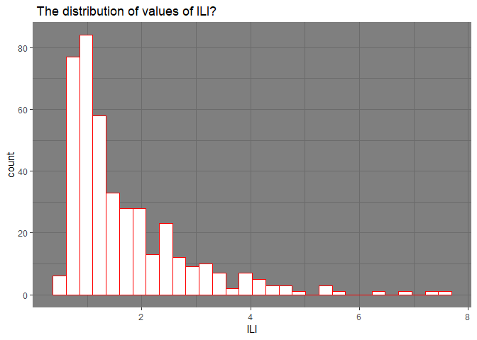
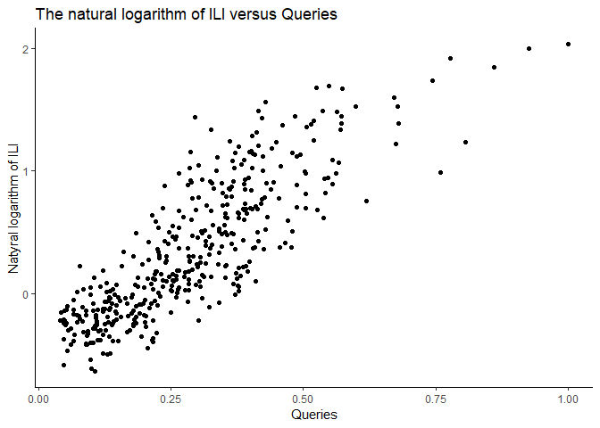
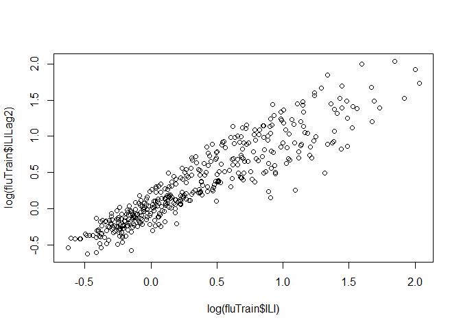

Detectino flu epidemics
================
Marwa Mohamed
11/16/2019

## overview

Flu epidemics constitute a major public health concern causing
respiratory illnesses, hospitalizations, and deaths. According to the
National Vital Statistics Reports published in October 2012, influenza
ranked as the eighth leading cause of death in 2011 in the United
States. Each year, 250,000 to 500,000 deaths are attributed to influenza
related diseases throughout the world.

The U.S. Centers for Disease Control and Prevention (CDC) and the
European Influenza Surveillance Scheme (EISS) detect influenza activity
through virologic and clinical data, including Influenza-like Illness
(ILI) physician visits. Reporting national and regional data, however,
are published with a 1-2 week lag.

The Google Flu Trends project was initiated to see if faster reporting
can be made possible by considering flu-related online search queries –
data that is available almost immediately.

## R Markdown

This is an R Markdown document. Markdown is a simple formatting syntax
for authoring HTML, PDF, and MS Word documents. For more details on
using R Markdown see <http://rmarkdown.rstudio.com>.

When you click the **Knit** button a document will be generated that
includes both content as well as the output of any embedded R code
chunks within the document. You can embed an R code chunk like this:

### 0: Load the data in RStudio

``` r
fluTrain = read_csv("data/FluTrain.csv")
```

    ## Parsed with column specification:
    ## cols(
    ##   Week = col_character(),
    ##   ILI = col_double(),
    ##   Queries = col_double()
    ## )

``` r
str(fluTrain)
```

    ## Classes 'spec_tbl_df', 'tbl_df', 'tbl' and 'data.frame': 417 obs. of  3 variables:
    ##  $ Week   : chr  "2004-01-04 - 2004-01-10" "2004-01-11 - 2004-01-17" "2004-01-18 - 2004-01-24" "2004-01-25 - 2004-01-31" ...
    ##  $ ILI    : num  2.42 1.81 1.71 1.54 1.44 ...
    ##  $ Queries: num  0.238 0.22 0.226 0.238 0.224 ...
    ##  - attr(*, "spec")=
    ##   .. cols(
    ##   ..   Week = col_character(),
    ##   ..   ILI = col_double(),
    ##   ..   Queries = col_double()
    ##   .. )

``` r
fluTest = read_csv("data/FluTest.csv")
```

    ## Parsed with column specification:
    ## cols(
    ##   Week = col_character(),
    ##   ILI = col_double(),
    ##   Queries = col_double()
    ## )

``` r
str(fluTest)
```

    ## Classes 'spec_tbl_df', 'tbl_df', 'tbl' and 'data.frame': 52 obs. of  3 variables:
    ##  $ Week   : chr  "2012-01-01 - 2012-01-07" "2012-01-08 - 2012-01-14" "2012-01-15 - 2012-01-21" "2012-01-22 - 2012-01-28" ...
    ##  $ ILI    : num  1.77 1.54 1.65 1.68 1.86 ...
    ##  $ Queries: num  0.594 0.499 0.501 0.479 0.471 ...
    ##  - attr(*, "spec")=
    ##   .. cols(
    ##   ..   Week = col_character(),
    ##   ..   ILI = col_double(),
    ##   ..   Queries = col_double()
    ##   .. )

## Select data

``` r
#the week that corresponds to the highest percentage of ILI-related physician visits?
fluTrain[max(fluTrain$ILI), ]
```

    ## # A tibble: 1 x 3
    ##   Week                      ILI Queries
    ##   <chr>                   <dbl>   <dbl>
    ## 1 2004-02-15 - 2004-02-21  1.31   0.242

``` r
((fluTrain %>% 
  filter(ILI == max(ILI)))[1])
```

    ## # A tibble: 1 x 1
    ##   Week                   
    ##   <chr>                  
    ## 1 2009-10-18 - 2009-10-24

``` r
#the week that corresponds to the highest percentage of ILI-related query fraction
((fluTrain %>% 
  filter(Queries == max(Queries)))[1])
```

    ## # A tibble: 1 x 1
    ##   Week                   
    ##   <chr>                  
    ## 1 2009-10-18 - 2009-10-24

## Understanding the Data

``` r
fluTrain %>% 
  ggplot(aes(x = ILI)) + 
  geom_histogram(col = "red", fill = "white") +
  labs(title = " The distribution of values of ILI?") +
  theme_dark()
```

    ## `stat_bin()` using `bins = 30`. Pick better value with `binwidth`.

<!-- -->

``` r
#Plot the natural logarithm of ILI versus Queries.
fluTrain %>% 
  ggplot(aes(x = Queries, y = log(ILI))) + 
  geom_point(col = "black") +
  labs(title = "The natural logarithm of ILI versus Queries", y = "Natyral logarithm of ILI") +
  theme_classic()
```

<!-- -->

## Linear Regression Model

``` r
fluModel <- lm(log(ILI) ~ Queries, data = fluTrain)
summary(fluModel)
```

    ## 
    ## Call:
    ## lm(formula = log(ILI) ~ Queries, data = fluTrain)
    ## 
    ## Residuals:
    ##      Min       1Q   Median       3Q      Max 
    ## -0.76003 -0.19696 -0.01657  0.18685  1.06450 
    ## 
    ## Coefficients:
    ##             Estimate Std. Error t value Pr(>|t|)    
    ## (Intercept) -0.49934    0.03041  -16.42   <2e-16 ***
    ## Queries      2.96129    0.09312   31.80   <2e-16 ***
    ## ---
    ## Signif. codes:  0 '***' 0.001 '**' 0.01 '*' 0.05 '.' 0.1 ' ' 1
    ## 
    ## Residual standard error: 0.2995 on 415 degrees of freedom
    ## Multiple R-squared:  0.709,  Adjusted R-squared:  0.7083 
    ## F-statistic:  1011 on 1 and 415 DF,  p-value: < 2.2e-16

## Calculate correlation

``` r
corr = cor(log(fluTrain$ILI), fluTrain$Queries)
```

## Performance on the Test Set

``` r
fluPredict = exp(predict(fluModel, newdata = fluTest))

#the percentage of ILI-related physician visits for the week of March 11, 2012
estILI = fluPredict[which(fluTest$Week == "2012-03-11 - 2012-03-17")]
#observed ILI for the week of March 11, 2012
obsILI = (fluTest %>% 
  filter(fluTest$Week == "2012-03-11 - 2012-03-17"))[2]
# relative error betweeen the estimate and the observed value for the week of March 11, 2012
relError = (obsILI - estILI)/obsILI

#RMSE
SSE = sum((fluTest$ILI - fluPredict)^2)
(RMSE = sqrt(SSE/nrow(fluTest)))
```

    ## [1] 0.7490645

\#\#Training a Time Series Model

``` r
#return 2 observations before the current one
ILILag_2 = lag(zoo(fluTrain$ILI), 2, na.pad=TRUE)

fluTrain$ILILag2 = coredata(ILILag_2)
#count of NA elements
fluTrain %>% 
  count(ILILag2 =="NA")
```

    ## # A tibble: 2 x 2
    ##   `ILILag2 == "NA"`     n
    ##   <lgl>             <int>
    ## 1 FALSE               415
    ## 2 NA                    2

``` r
# plot the log of ILILag2 against the log of ILI.
plot(log(fluTrain$ILI), log(fluTrain$ILILag2))
```

<!-- -->

``` r
#linear regression model
fluModel2 = lm(log(ILI) ~ Queries + log(ILILag2), data = fluTrain)
summary(fluModel2)
```

    ## 
    ## Call:
    ## lm(formula = log(ILI) ~ Queries + log(ILILag2), data = fluTrain)
    ## 
    ## Residuals:
    ##      Min       1Q   Median       3Q      Max 
    ## -0.52209 -0.11082 -0.01819  0.08143  0.76785 
    ## 
    ## Coefficients:
    ##              Estimate Std. Error t value Pr(>|t|)    
    ## (Intercept)  -0.24064    0.01953  -12.32   <2e-16 ***
    ## Queries       1.25578    0.07910   15.88   <2e-16 ***
    ## log(ILILag2)  0.65569    0.02251   29.14   <2e-16 ***
    ## ---
    ## Signif. codes:  0 '***' 0.001 '**' 0.01 '*' 0.05 '.' 0.1 ' ' 1
    ## 
    ## Residual standard error: 0.1703 on 412 degrees of freedom
    ##   (2 observations deleted due to missingness)
    ## Multiple R-squared:  0.9063, Adjusted R-squared:  0.9059 
    ## F-statistic:  1993 on 2 and 412 DF,  p-value: < 2.2e-16

``` r
#return 2 observations before the current one
ILILag_2 = lag(zoo(fluTest$ILI), 2, na.pad=TRUE)

fluTest$ILILag2 = coredata(ILILag_2)
#count of NA elements
fluTest %>% 
    count(ILILag2 =="NA")
```

    ## # A tibble: 2 x 2
    ##   `ILILag2 == "NA"`     n
    ##   <lgl>             <int>
    ## 1 FALSE                50
    ## 2 NA                    2

``` r
#Fill in the missing values for ILILag2 in FluTest with 2 weeks earlier
fluTest$ILILag2[1] = fluTrain$ILI[nrow(fluTrain) - 1]
fluTest$ILILag2[2] = fluTrain$ILI[nrow(fluTrain)]
```

## Performance on the Test Set

``` r
fluPredict2 = exp(predict(fluModel2, newdata = fluTest))

#RMSE
SSE = sum((fluTest$ILI - fluPredict2)^2)
(RMSE = sqrt(SSE/nrow(fluTest)))
```

    ## [1] 0.2942029
