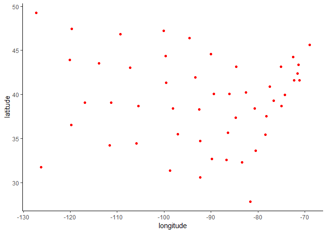
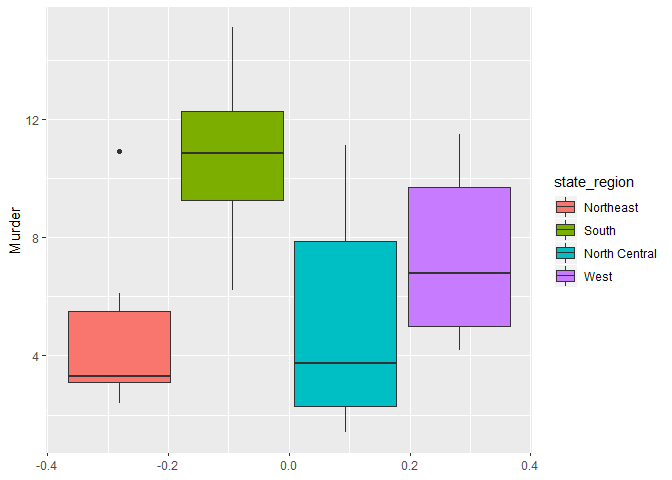

State data
================
Marwa Mohamed
11/20/2019

## overview

In this problem, we will be examining the “state” dataset, which has
data from the 1970s on all fifty US states. For each state, the dataset
includes the population, per capita income, illiteracy rate, murder
rate, high school graduation rate, average number of frost days, area,
latitude and longitude, division the state belongs to, region the state
belongs to, and two-letter abbreviation.

## R Markdown

This is an R Markdown document. Markdown is a simple formatting syntax
for authoring HTML, PDF, and MS Word documents. For more details on
using R Markdown see <http://rmarkdown.rstudio.com>.

When you click the **Knit** button a document will be generated that
includes both content as well as the output of any embedded R code
chunks within the document. You can embed an R code chunk like this:

\#\#Load the dataset and convert it to a data frame

``` r
data(state)

statedata = cbind(data.frame(state.x77), state.abb, state.area, state.center,  state.division, state.name, state.region)
str(statedata)
```

    ## 'data.frame':    50 obs. of  15 variables:
    ##  $ Population    : num  3615 365 2212 2110 21198 ...
    ##  $ Income        : num  3624 6315 4530 3378 5114 ...
    ##  $ Illiteracy    : num  2.1 1.5 1.8 1.9 1.1 0.7 1.1 0.9 1.3 2 ...
    ##  $ Life.Exp      : num  69 69.3 70.5 70.7 71.7 ...
    ##  $ Murder        : num  15.1 11.3 7.8 10.1 10.3 6.8 3.1 6.2 10.7 13.9 ...
    ##  $ HS.Grad       : num  41.3 66.7 58.1 39.9 62.6 63.9 56 54.6 52.6 40.6 ...
    ##  $ Frost         : num  20 152 15 65 20 166 139 103 11 60 ...
    ##  $ Area          : num  50708 566432 113417 51945 156361 ...
    ##  $ state.abb     : Factor w/ 50 levels "AK","AL","AR",..: 2 1 4 3 5 6 7 8 9 10 ...
    ##  $ state.area    : num  51609 589757 113909 53104 158693 ...
    ##  $ x             : num  -86.8 -127.2 -111.6 -92.3 -119.8 ...
    ##  $ y             : num  32.6 49.2 34.2 34.7 36.5 ...
    ##  $ state.division: Factor w/ 9 levels "New England",..: 4 9 8 5 9 8 1 3 3 3 ...
    ##  $ state.name    : Factor w/ 50 levels "Alabama","Alaska",..: 1 2 3 4 5 6 7 8 9 10 ...
    ##  $ state.region  : Factor w/ 4 levels "Northeast","South",..: 2 4 4 2 4 4 1 2 2 2 ...

## Including Plots

The shape of the plot should look like the outline of the United
States\! Note that Alaska and Hawaii have had their coordinates adjusted
to appear just off of the west coast.

<!-- --> \#\#Data
exploration determine which region of the US (West, North Central,
South, or Northeast) has the highest average high school graduation rate
of all the states in the region:

``` r
 # rename HS.Grad & state.region
colnames(statedata)[6] <- 'HS_Grad'
colnames(statedata)[15] <- 'state_region'
  tapply(statedata$HS_Grad, statedata$state_region, max)
```

    ##     Northeast         South North Central          West 
    ##          58.5          54.6          59.9          67.3

## 

make a boxplot of the murder rate by region

``` r
statedata %>% 
  group_by(state_region) %>% 
  ggplot() +
  geom_boxplot(aes(y = Murder, fill = state_region))
```

<!-- --> \#the
corresponding state of the outlier in the Northeast region in the
boxplot

``` r
northEast <- statedata %>% 
  filter(state_region == 'Northeast') 
str(northEast)
```

    ## 'data.frame':    9 obs. of  15 variables:
    ##  $ Population    : num  3100 1058 5814 812 7333 ...
    ##  $ Income        : num  5348 3694 4755 4281 5237 ...
    ##  $ Illiteracy    : num  1.1 0.7 1.1 0.7 1.1 1.4 1 1.3 0.6
    ##  $ Life.Exp      : num  72.5 70.4 71.8 71.2 70.9 ...
    ##  $ Murder        : num  3.1 2.7 3.3 3.3 5.2 10.9 6.1 2.4 5.5
    ##  $ HS_Grad       : num  56 54.7 58.5 57.6 52.5 52.7 50.2 46.4 57.1
    ##  $ Frost         : num  139 161 103 174 115 82 126 127 168
    ##  $ Area          : num  4862 30920 7826 9027 7521 ...
    ##  $ state.abb     : Factor w/ 50 levels "AK","AL","AR",..: 7 21 19 30 31 34 38 39 46
    ##  $ state.area    : num  5009 33215 8257 9304 7836 ...
    ##  $ x             : num  -72.4 -69 -71.6 -71.4 -74.2 ...
    ##  $ y             : num  41.6 45.6 42.4 43.4 40 ...
    ##  $ state.division: Factor w/ 9 levels "New England",..: 1 1 1 1 2 2 2 1 1
    ##  $ state.name    : Factor w/ 50 levels "Alabama","Alaska",..: 7 19 21 29 30 32 38 39 45
    ##  $ state_region  : Factor w/ 4 levels "Northeast","South",..: 1 1 1 1 1 1 1 1 1

``` r
northEast[which.max(northEast$Murder),14]
```

    ## [1] New York
    ## 50 Levels: Alabama Alaska Arizona Arkansas California ... Wyoming

\#\#Predicting Life Expectancy - An Initial
Model

``` r
expectancyModdel = lm(Life.Exp ~ Population + Income + Illiteracy + Murder + HS_Grad + Frost + Area, data = statedata)
summary(expectancyModdel)
```

    ## 
    ## Call:
    ## lm(formula = Life.Exp ~ Population + Income + Illiteracy + Murder + 
    ##     HS_Grad + Frost + Area, data = statedata)
    ## 
    ## Residuals:
    ##      Min       1Q   Median       3Q      Max 
    ## -1.48895 -0.51232 -0.02747  0.57002  1.49447 
    ## 
    ## Coefficients:
    ##               Estimate Std. Error t value Pr(>|t|)    
    ## (Intercept)  7.094e+01  1.748e+00  40.586  < 2e-16 ***
    ## Population   5.180e-05  2.919e-05   1.775   0.0832 .  
    ## Income      -2.180e-05  2.444e-04  -0.089   0.9293    
    ## Illiteracy   3.382e-02  3.663e-01   0.092   0.9269    
    ## Murder      -3.011e-01  4.662e-02  -6.459 8.68e-08 ***
    ## HS_Grad      4.893e-02  2.332e-02   2.098   0.0420 *  
    ## Frost       -5.735e-03  3.143e-03  -1.825   0.0752 .  
    ## Area        -7.383e-08  1.668e-06  -0.044   0.9649    
    ## ---
    ## Signif. codes:  0 '***' 0.001 '**' 0.01 '*' 0.05 '.' 0.1 ' ' 1
    ## 
    ## Residual standard error: 0.7448 on 42 degrees of freedom
    ## Multiple R-squared:  0.7362, Adjusted R-squared:  0.6922 
    ## F-statistic: 16.74 on 7 and 42 DF,  p-value: 2.534e-10

``` r
plot(statedata$Income, statedata$Life.Exp)
```

<!-- -->
\#\#Improving
model

``` r
expectancyModel2 = lm(Life.Exp ~ Population + Murder + HS_Grad + Frost, data = statedata)
summary(expectancyModel2)
```

    ## 
    ## Call:
    ## lm(formula = Life.Exp ~ Population + Murder + HS_Grad + Frost, 
    ##     data = statedata)
    ## 
    ## Residuals:
    ##      Min       1Q   Median       3Q      Max 
    ## -1.47095 -0.53464 -0.03701  0.57621  1.50683 
    ## 
    ## Coefficients:
    ##               Estimate Std. Error t value Pr(>|t|)    
    ## (Intercept)  7.103e+01  9.529e-01  74.542  < 2e-16 ***
    ## Population   5.014e-05  2.512e-05   1.996  0.05201 .  
    ## Murder      -3.001e-01  3.661e-02  -8.199 1.77e-10 ***
    ## HS_Grad      4.658e-02  1.483e-02   3.142  0.00297 ** 
    ## Frost       -5.943e-03  2.421e-03  -2.455  0.01802 *  
    ## ---
    ## Signif. codes:  0 '***' 0.001 '**' 0.01 '*' 0.05 '.' 0.1 ' ' 1
    ## 
    ## Residual standard error: 0.7197 on 45 degrees of freedom
    ## Multiple R-squared:  0.736,  Adjusted R-squared:  0.7126 
    ## F-statistic: 31.37 on 4 and 45 DF,  p-value: 1.696e-12

\#\#Predict life expectancy

``` r
lifePred= predict(expectancyModel2, newdata = statedata)
summary(lifePred)
```

    ##    Min. 1st Qu.  Median    Mean 3rd Qu.    Max. 
    ##   68.48   69.99   71.09   70.88   71.87   72.68

``` r
# the state that predicted to have the lowest life expectancy
sort(lifePred)[1]
```

    ##  Alabama 
    ## 68.48112

``` r
# the state actually has the lowest life expectancy
statedata[which.min(statedata$Life.Exp), 14]
```

    ## [1] South Carolina
    ## 50 Levels: Alabama Alaska Arizona Arkansas California ... Wyoming

``` r
# the state that predicted to have the highest life expectancy
sort(lifePred)[length(lifePred)]
```

    ## Washington 
    ##   72.68272

``` r
# the state actually has the lowest life expectancy
statedata[which.max(statedata$Life.Exp), 14]
```

    ## [1] Hawaii
    ## 50 Levels: Alabama Alaska Arizona Arkansas California ... Wyoming

``` r
# the state that make the smallest absolute error
which.min(abs(expectancyModel2$residuals))
```

    ## Indiana 
    ##      14

``` r
# the state that make the highest absolute error
which.max(abs(expectancyModel2$residuals))
```

    ## Hawaii 
    ##     11
