Analysis of IGN dataset in R
================

Given my recent foray into R and ggplot, it seemed appropriate to take a
break from the usual Python jupyter notebooks. I have chosen IGN dataset
from kaggle here <https://www.kaggle.com/egrinstein/20-years-of-games>
to do a quick data manipulation and visualization of the data.

``` r
# load packages
library(tidyverse)
```

    ## Warning: package 'tidyverse' was built under R version 3.5.3

    ## -- Attaching packages -------------------------------------------------------------------------------- tidyverse 1.2.1 --

    ## v ggplot2 3.1.1     v purrr   0.3.2
    ## v tibble  2.1.1     v dplyr   0.8.1
    ## v tidyr   0.8.3     v stringr 1.4.0
    ## v readr   1.3.1     v forcats 0.4.0

    ## Warning: package 'ggplot2' was built under R version 3.5.3

    ## Warning: package 'tibble' was built under R version 3.5.3

    ## Warning: package 'tidyr' was built under R version 3.5.3

    ## Warning: package 'readr' was built under R version 3.5.3

    ## Warning: package 'purrr' was built under R version 3.5.3

    ## Warning: package 'dplyr' was built under R version 3.5.3

    ## Warning: package 'stringr' was built under R version 3.5.3

    ## Warning: package 'forcats' was built under R version 3.5.3

    ## -- Conflicts ----------------------------------------------------------------------------------- tidyverse_conflicts() --
    ## x dplyr::filter() masks stats::filter()
    ## x dplyr::lag()    masks stats::lag()

``` r
library(readr)
```

After loading the tidyverse package, which contains useful packages like
ggplot2 and dplyr, we begin by reading in the csv not as factors.

``` r
# read csv of ign data into a dataframe
ign <- read.csv('data/ign.csv', stringsAsFactors = FALSE)
head(ign)
```

    ##   X score_phrase                                                title
    ## 1 0      Amazing                              LittleBigPlanet PS Vita
    ## 2 1      Amazing LittleBigPlanet PS Vita -- Marvel Super Hero Edition
    ## 3 2        Great                                 Splice: Tree of Life
    ## 4 3        Great                                               NHL 13
    ## 5 4        Great                                               NHL 13
    ## 6 5         Good                            Total War Battles: Shogun
    ##                                                                      url
    ## 1                                 /games/littlebigplanet-vita/vita-98907
    ## 2 /games/littlebigplanet-ps-vita-marvel-super-hero-edition/vita-20027059
    ## 3                                              /games/splice/ipad-141070
    ## 4                                          /games/nhl-13/xbox-360-128182
    ## 5                                               /games/nhl-13/ps3-128181
    ## 6                             /games/total-war-battles-shogun/mac-142565
    ##           platform score      genre editors_choice release_year
    ## 1 PlayStation Vita   9.0 Platformer              Y         2012
    ## 2 PlayStation Vita   9.0 Platformer              Y         2012
    ## 3             iPad   8.5     Puzzle              N         2012
    ## 4         Xbox 360   8.5     Sports              N         2012
    ## 5    PlayStation 3   8.5     Sports              N         2012
    ## 6        Macintosh   7.0   Strategy              N         2012
    ##   release_month release_day
    ## 1             9          12
    ## 2             9          12
    ## 3             9          12
    ## 4             9          11
    ## 5             9          11
    ## 6             9          11

A quick look at the dataframe reveal some interesting variables. In
particular, the title, platform, score, genre, and release\_year
variables.

``` r
# a summary of the variables in the dataframe
str(ign)
```

    ## 'data.frame':    18625 obs. of  11 variables:
    ##  $ X             : int  0 1 2 3 4 5 6 7 8 9 ...
    ##  $ score_phrase  : chr  "Amazing" "Amazing" "Great" "Great" ...
    ##  $ title         : chr  "LittleBigPlanet PS Vita" "LittleBigPlanet PS Vita -- Marvel Super Hero Edition" "Splice: Tree of Life" "NHL 13" ...
    ##  $ url           : chr  "/games/littlebigplanet-vita/vita-98907" "/games/littlebigplanet-ps-vita-marvel-super-hero-edition/vita-20027059" "/games/splice/ipad-141070" "/games/nhl-13/xbox-360-128182" ...
    ##  $ platform      : chr  "PlayStation Vita" "PlayStation Vita" "iPad" "Xbox 360" ...
    ##  $ score         : num  9 9 8.5 8.5 8.5 7 3 9 3 7 ...
    ##  $ genre         : chr  "Platformer" "Platformer" "Puzzle" "Sports" ...
    ##  $ editors_choice: chr  "Y" "Y" "N" "N" ...
    ##  $ release_year  : int  2012 2012 2012 2012 2012 2012 2012 2012 2012 2012 ...
    ##  $ release_month : int  9 9 9 9 9 9 9 9 9 9 ...
    ##  $ release_day   : int  12 12 12 11 11 11 11 11 11 11 ...

``` r
summary(ign)
```

    ##        X         score_phrase          title               url           
    ##  Min.   :    0   Length:18625       Length:18625       Length:18625      
    ##  1st Qu.: 4656   Class :character   Class :character   Class :character  
    ##  Median : 9312   Mode  :character   Mode  :character   Mode  :character  
    ##  Mean   : 9312                                                           
    ##  3rd Qu.:13968                                                           
    ##  Max.   :18624                                                           
    ##    platform             score          genre           editors_choice    
    ##  Length:18625       Min.   : 0.50   Length:18625       Length:18625      
    ##  Class :character   1st Qu.: 6.00   Class :character   Class :character  
    ##  Mode  :character   Median : 7.30   Mode  :character   Mode  :character  
    ##                     Mean   : 6.95                                        
    ##                     3rd Qu.: 8.20                                        
    ##                     Max.   :10.00                                        
    ##   release_year  release_month     release_day  
    ##  Min.   :1970   Min.   : 1.000   Min.   : 1.0  
    ##  1st Qu.:2003   1st Qu.: 4.000   1st Qu.: 8.0  
    ##  Median :2007   Median : 8.000   Median :16.0  
    ##  Mean   :2007   Mean   : 7.138   Mean   :15.6  
    ##  3rd Qu.:2010   3rd Qu.:10.000   3rd Qu.:23.0  
    ##  Max.   :2016   Max.   :12.000   Max.   :31.0

``` r
names(ign)
```

    ##  [1] "X"              "score_phrase"   "title"          "url"           
    ##  [5] "platform"       "score"          "genre"          "editors_choice"
    ##  [9] "release_year"   "release_month"  "release_day"

A look at the top rated titles don’t seem to be too interesting as there
are multiple title with scores of 9 and 10. Let’s instead look at the
average review scores based on particular groupings.

Top-rated titles

``` r
head(ign[order(ign$score, decreasing = TRUE),])
```

    ##         X score_phrase                                title
    ## 1059 1058  Masterpiece The Legend of Zelda: Ocarina of Time
    ## 1288 1287  Masterpiece                 Pokemon Blue Version
    ## 1290 1289  Masterpiece                  Pokemon Red Version
    ## 1355 1354  Masterpiece                                Joust
    ## 1364 1363  Masterpiece                             Shanghai
    ## 1409 1408  Masterpiece                       Checkered Flag
    ##                                                     url    platform score
    ## 1059 /games/the-legend-of-zelda-ocarina-of-time/n64-437 Nintendo 64    10
    ## 1288               /games/pokemon-blue-version/gb-16708    Game Boy    10
    ## 1290                 /games/pokemon-red-version/gb-9846    Game Boy    10
    ## 1355                     /games/defenderjoust/lynx-4146        Lynx    10
    ## 1364                   /games/shanghai-809520/lynx-5876        Lynx    10
    ## 1409                    /games/checkered-flag/lynx-4136        Lynx    10
    ##                  genre editors_choice release_year release_month
    ## 1059 Action, Adventure              Y         1998            11
    ## 1288               RPG              Y         1999             6
    ## 1290               RPG              Y         1999             6
    ## 1355            Action              N         1999             7
    ## 1364            Puzzle              N         1999             7
    ## 1409            Racing              N         1999             7
    ##      release_day
    ## 1059          25
    ## 1288          23
    ## 1290          23
    ## 1355           6
    ## 1364           6
    ## 1409           6

``` r
length(unique(ign$genre))
```

    ## [1] 113

As there are 112 unique genres, lets just take the top 10 genres.
Top-rated genre

``` r
ign %>%
  group_by(genre) %>%
  summarise(mean_score = mean(score)) %>%
  arrange(desc(mean_score)) %>%
  head(., n=10) %>%
  ggplot() +
  geom_bar(aes(x=reorder(genre, -mean_score), y=mean_score, fill=genre), stat="identity") +
  geom_label(aes(x=reorder(genre, -mean_score), y=mean_score, label = round(mean_score,digits = 2))) +
  guides(fill = FALSE) +
  labs(title = "Top 10 Genres by Mean Review Score", x="Genre", y="Mean Review Score") +
  theme(axis.text.x = element_text(size = 10, angle = 45, hjust = 1))
```

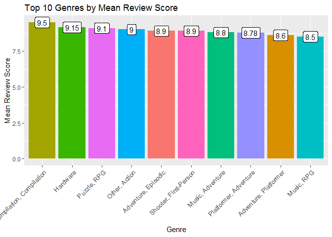<!-- -->

``` r
length(unique(ign$platform))
```

    ## [1] 59

Similarly, we take the top 10 out of 59 platforms examine the average
review score.

Top-rated platforms

``` r
ign %>%
  group_by(platform) %>%
  summarise(mean_score = mean(score)) %>%
  arrange(desc(mean_score)) %>%
  head(., n=10) %>%
  ggplot() +
  geom_bar(aes(x=reorder(platform, -mean_score), y=mean_score, fill = platform), stat="identity") +
  geom_label(aes(x=reorder(platform, -mean_score), y=mean_score, label=round(mean_score, digits = 2))) +
  labs(title = "Top 10 Platforms by Mean Review Score", x="Platform", y="Mean Review Score") +
  theme(axis.text.x = element_text(size = 10, angle = 45, hjust = 1)) + 
  guides(fill = FALSE)
```

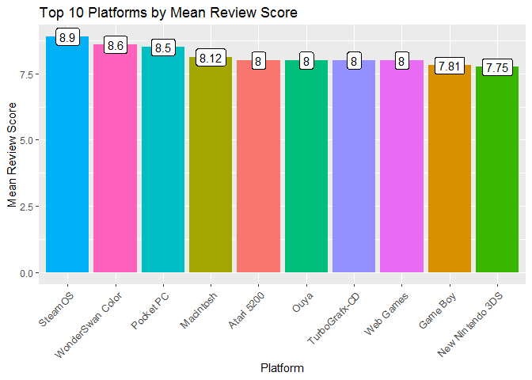<!-- -->

Number of Games in Each Platform

``` r
ign %>%
  group_by(platform) %>%
  summarise(counts = n()) %>%
  arrange(desc(counts)) %>%
  head(., n=10) %>%
  ggplot() +
  geom_bar(aes(x=reorder(platform, -counts), y=counts, fill=platform), stat="identity") +
  geom_label(aes(x=reorder(platform, -counts), y=counts, label = counts)) + 
  labs(title = "Top 10 Platforms by Number of Games", x="Platform", y="Total Number of Games") +
  theme(axis.text.x = element_text(size = 10, angle = 45, hjust = 1)) + 
  guides(fill = FALSE)
```

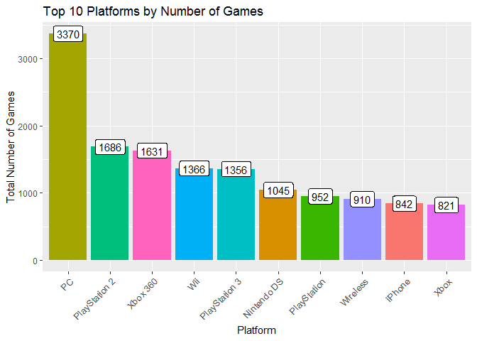<!-- -->

Are all 122 genres necessary? The division here might be too granular.
There are quite a few genres like ‘Adventure, Platformer’ and
‘Adventure, Episodic’ that have the same primary genre of ‘Adventure’.
I thus wrote a function to get the primary genre of each game by taking
the first word of the genre variable.

String split function

``` r
# string split function to get the main game genre
get_genre <- function(string) {
  length <- sapply(strsplit(string, ","), length)
  return(sapply(strsplit(string,","), function(x) x[1]))
}
get_genre("Compilation, Compilation")
```

    ## [1] "Compilation"

The new main\_genre variable now includes a much more manageable 31
unique genres. There seems to be one named NA though. Lets take a look.

Consolidating genres

``` r
# creating new column for main genre based on above created function
ign$main_genre <- get_genre(ign$genre)
unique(ign$main_genre)
```

    ##  [1] "Platformer"   "Puzzle"       "Sports"       "Strategy"    
    ##  [5] "Fighting"     "RPG"          NA             "Action"      
    ##  [9] "Adventure"    "Shooter"      "Music"        "Board"       
    ## [13] "Racing"       "Simulation"   "Flight"       "Educational" 
    ## [17] "Wrestling"    "Productivity" "Party"        "Battle"      
    ## [21] "Card"         "Compilation"  "Pinball"      "Hunting"     
    ## [25] "Casino"       "Trivia"       "Other"        "Virtual Pet" 
    ## [29] "Adult"        "Baseball"     "Hardware"

There are 36 rows with missing genre values. As this is a really small
sample of the 18,000+ observations and it would take unecessary effort
to label them manually, we drop these observations with NA genre values.

Dropping NA values

``` r
# games that dont have a genre
head(ign[is.na(ign$main_genre),])
```

    ##         X score_phrase            title
    ## 13     12         Good       Wild Blood
    ## 114   113         Good      Retro/Grade
    ## 161   160         Good         10000000
    ## 177   176         Okay      Colour Bind
    ## 9376 9375        Great Duke Nukem Arena
    ## 9489 9488         Okay          Rengoku
    ##                                      url      platform score genre
    ## 13       /games/wild-blood/iphone-139363        iPhone   7.0      
    ## 114   /games/retrograde-138590/ps3-21766 PlayStation 3   7.0      
    ## 161        /games/10000000/iphone-139135        iPhone   7.5      
    ## 177         /games/colour-bind/pc-143757            PC   6.2      
    ## 9376 /games/duke-nukem-arena/cell-893821      Wireless   8.0      
    ## 9489          /games/rengoku/cell-924924      Wireless   6.5      
    ##      editors_choice release_year release_month release_day main_genre
    ## 13                N         2012             9          10       <NA>
    ## 114               N         2012             8          15       <NA>
    ## 161               N         2012             8           9       <NA>
    ## 177               N         2012            10          15       <NA>
    ## 9376              Y         2007             6          15       <NA>
    ## 9489              N         2007             6          26       <NA>

``` r
# checking to see if NA are dropped
ign <- ign[!is.na(ign$main_genre),]
dim(ign)
```

    ## [1] 18589    12

Double-checking here to make sure there aren’t any NA values in the
other values.

``` r
# checking for any other missing values
apply(ign, 2, function(x) any(is.na(x)))
```

    ##              X   score_phrase          title            url       platform 
    ##          FALSE          FALSE          FALSE          FALSE          FALSE 
    ##          score          genre editors_choice   release_year  release_month 
    ##          FALSE          FALSE          FALSE          FALSE          FALSE 
    ##    release_day     main_genre 
    ##          FALSE          FALSE

With the newly reduced genres, lets look at the mean review score
distribution again, this time with all the genres. We see that
compilation games have dropped quite far back while hardware games
remain far and away the highest rated games. What are hardware games
though?

``` r
ign %>%
  group_by(main_genre) %>%
  summarise(mean_score = mean(score)) %>%
  arrange(desc(mean_score)) %>%
  head(., n=10) %>%
  ggplot() +
  geom_bar(aes(x=reorder(main_genre, -mean_score), y=mean_score, fill = main_genre), stat="identity") +
  labs(title = "Top 10 Main Genres by Mean Review Score", x="Main Genre", y="Mean Review Score") +
  theme(axis.text.x = element_text(size = 10, angle = 45, hjust = 1)) + 
  guides(fill = FALSE)
```

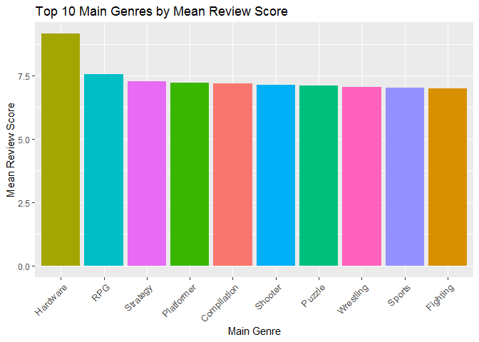<!-- -->

``` r
ign %>%
  group_by(main_genre) %>%
  summarise(mean_score = mean(score)) %>%
  arrange(desc(mean_score)) %>%
  ggplot() +
  geom_bar(aes(x=reorder(main_genre, -mean_score), y=mean_score, fill = main_genre), stat="identity") +
  labs(title = "All Main Genres by Mean Review Score", x="Main Genre", y="Mean Review Score") +
  theme(axis.text.x = element_text(size = 10, angle = 60, hjust = 1)) + 
  guides(fill = FALSE)
```

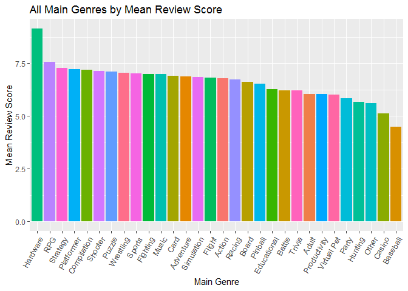<!-- -->

Apparently they refer to VR hardware and are only represented by two
entries. Given the nascent VR industry, this paucity of observations
seems to be
    appropriate.

``` r
ign[ign$main_genre == 'Hardware',]
```

    ##           X score_phrase       title                            url
    ## 18491 18490      Amazing    HTC Vive    /games/htc-vive/pc-20051797
    ## 18534 18533      Amazing Oculus Rift /games/oculus-rift/pc-20022665
    ##       platform score    genre editors_choice release_year release_month
    ## 18491       PC   9.3 Hardware              Y         2016             4
    ## 18534       PC   9.0 Hardware              Y         2016             3
    ##       release_day main_genre
    ## 18491           7   Hardware
    ## 18534          31   Hardware

Given that the hardware category only has two observations, which are
the genres with the most games?

``` r
ign %>%
  group_by(main_genre) %>%
  summarise(games_count = n()) %>%
  arrange(desc(games_count)) %>%
  ggplot() +
  geom_bar(aes(x=reorder(main_genre, -games_count), y=games_count, fill = main_genre), stat="identity") +
  labs(title = "All Main Genres by Total Number of Games", x="Main Genre", y="Total Number of Games") +
  theme(axis.text.x = element_text(size = 10, angle = 60, hjust = 1)) + 
  guides(fill = FALSE)
```

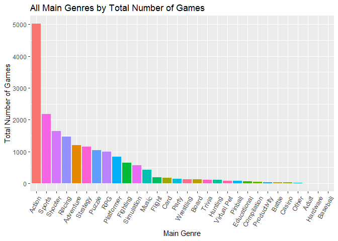<!-- -->

``` r
ign %>%
  group_by(main_genre) %>%
  summarise(total_games = n()) %>%
  ggplot() +
  geom_point(aes(x=reorder(main_genre, -total_games), y=total_games), size =3) + 
  geom_segment(aes(x=reorder(main_genre, -total_games),
                   xend=reorder(main_genre, -total_games),
                   y=0,
                   yend=total_games)) + 
  theme(axis.text.x = element_text(size = 10, angle = 60, hjust = 1)) +
  labs(title="Lollipop Chart of All Genres By Total Game Count",
       x="Genre",
       y="Total Game Count")
```

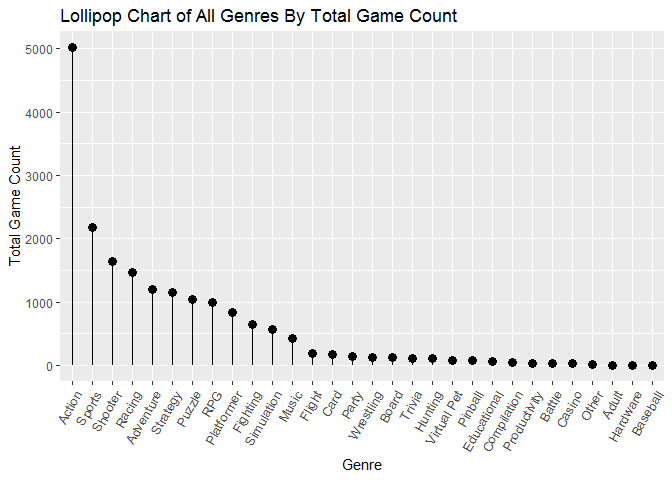<!-- -->

Group by Title

By looking at unique titles, there are 6033 titles, around 1/3 of the
total that repeat. We will create a new dataframe that ignores the
platform that they are on and focuses on the title.

``` r
length(ign$title) - length(unique(ign$title))
```

    ## [1] 6033

Using grepl to filter by string in a title

``` r
ign %>%
  filter(., grepl("LittleBigPlanet", title))
```

    ##       X score_phrase                                                title
    ## 1     0      Amazing                              LittleBigPlanet PS Vita
    ## 2     1      Amazing LittleBigPlanet PS Vita -- Marvel Super Hero Edition
    ## 3   241     Mediocre                              LittleBigPlanet Karting
    ## 4 11646      Amazing                                      LittleBigPlanet
    ## 5 13400      Amazing           LittleBigPlanet (Game of the Year Edition)
    ## 6 13818      Amazing                                      LittleBigPlanet
    ## 7 15285         Okay         LittleBigPlanet: Sackboy's Prehistoric Moves
    ## 8 15523      Amazing                                    LittleBigPlanet 2
    ## 9 17997         Okay                                    LittleBigPlanet 3
    ##                                                                      url
    ## 1                                 /games/littlebigplanet-vita/vita-98907
    ## 2 /games/littlebigplanet-ps-vita-marvel-super-hero-edition/vita-20027059
    ## 3                              /games/littlebigplanet-karting/ps3-128163
    ## 4                               /games/littlebigplanet-891799/ps3-856680
    ## 5                                /games/littlebigplanet-891799/ps3-20076
    ## 6                                /games/littlebigplanet-psp/psp-14286080
    ## 7            /games/littlebigplanet-sackboys-prehistoric-moves/ps3-33583
    ## 8                                     /games/littlebigplanet-2/ps3-19675
    ## 9                                    /games/littlebigplanet-3/ps4-159982
    ##               platform score      genre editors_choice release_year
    ## 1     PlayStation Vita   9.0 Platformer              Y         2012
    ## 2     PlayStation Vita   9.0 Platformer              Y         2012
    ## 3        PlayStation 3   5.0     Racing              N         2012
    ## 4        PlayStation 3   9.5 Platformer              Y         2008
    ## 5        PlayStation 3   9.5 Platformer              Y         2009
    ## 6 PlayStation Portable   9.0 Platformer              Y         2009
    ## 7        PlayStation 3   6.5 Platformer              N         2010
    ## 8        PlayStation 3   9.0 Platformer              Y         2011
    ## 9        PlayStation 4   6.8 Platformer              N         2014
    ##   release_month release_day main_genre
    ## 1             9          12 Platformer
    ## 2             9          12 Platformer
    ## 3            11           6     Racing
    ## 4            10          13 Platformer
    ## 5             9           9 Platformer
    ## 6            11          17 Platformer
    ## 7            12           8 Platformer
    ## 8             1           4 Platformer
    ## 9            11          18 Platformer

``` r
grouped_title_ign <- ign %>%
  group_by(title) %>%
  summarise(score = round(mean(score),1), release_year = first(release_year), count=n(), main_genre = first(main_genre))
tail(grouped_title_ign, limit=5)
```

    ## # A tibble: 6 x 5
    ##   title                     score release_year count main_genre
    ##   <chr>                     <dbl>        <int> <int> <chr>     
    ## 1 Zubo                        7.5         2009     1 Music     
    ## 2 Zuma                        8.4         2005     3 Puzzle    
    ## 3 Zuma's Revenge              7.5         2009     2 Puzzle    
    ## 4 Zuma Deluxe                 8           2006     1 Puzzle    
    ## 5 Zumba Fitness World Party   7.2         2014     1 Sports    
    ## 6 Zusar Vasar                 6           2000     1 Racing

Top genres again after grouping

``` r
grouped_title_ign %>%
  group_by(main_genre) %>%
  summarise(mean_score = round(mean(score),2)) %>%
  ggplot() +
  geom_bar(stat="identity", aes(x=reorder(main_genre, -mean_score), y=mean_score, fill = main_genre)) +
  guides(fill = FALSE) +
  theme(axis.text.x = element_text(size = 10, angle = 45, hjust = 1)) + 
  labs(title = "All Main Genres by Mean Review Score (After Grouping)", x="Main Genre", y="Mean Review Score")
```

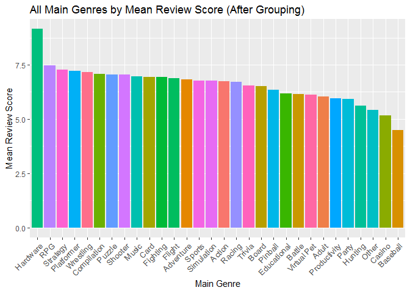<!-- -->

Top genres by game count

``` r
grouped_title_ign %>%
  group_by(main_genre) %>%
  summarise(total_games = n()) %>%
  ggplot() +
  geom_bar(stat="identity", aes(x=reorder(main_genre, -total_games), y=total_games, fill = main_genre)) +
  guides(fill = FALSE) +
  theme(axis.text.x = element_text(size = 10, angle = 60, hjust = 1)) + 
  labs(title = "All Main Genres by Total Game Count", x="Main Genre", y="Total Game Count")
```

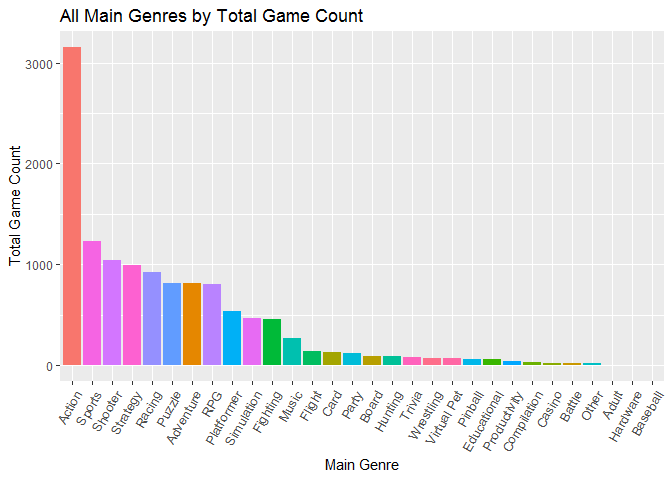<!-- -->

Lollipop chart

``` r
grouped_title_ign %>%
  group_by(main_genre) %>%
  summarise(total_games = n()) %>%
  ggplot() +
  geom_point(aes(x=reorder(main_genre, -total_games), y=total_games), size =3) + 
  geom_segment(aes(x=reorder(main_genre, -total_games),
                   xend=reorder(main_genre, -total_games),
                   y=0,
                   yend=total_games)) + 
  theme(axis.text.x = element_text(size = 10, angle = 60, hjust = 1)) +
  labs(title="Lollipop Chart of All Main Genres By Total Game Count",
       x="Main Genre",
       y="Total Game Count")
```

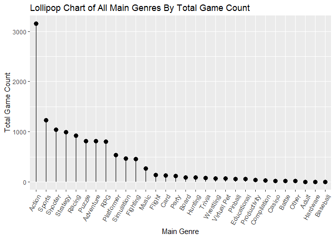<!-- -->

Pie chart

``` r
grouped_title_ign %>%
  group_by(main_genre) %>%
  summarise(total_games = n()) %>%
  arrange(desc(total_games)) %>%
  head(n=12) %>%
  ggplot() + 
  geom_bar(aes(x='', y=total_games,fill=factor(main_genre)), width=1, stat="identity") +
  theme(axis.line = element_blank(), 
        plot.title = element_text(hjust=0.5)) + 
  coord_polar(theta="y", start=0) +
  labs(fill="Main Genre", 
       x=NULL,
       y=NULL,
       title="Distribution of Games Across Top Genres")
```

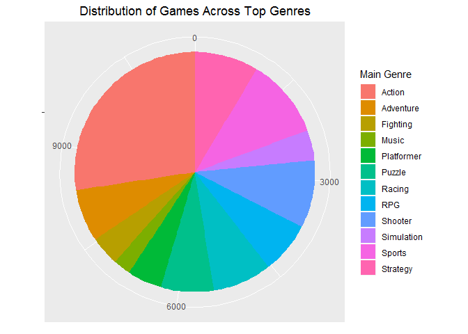<!-- -->

``` r
grouped_title_ign %>%
  arrange(desc(count)) %>%
  tail()
```

    ## # A tibble: 6 x 5
    ##   title                       score release_year count main_genre
    ##   <chr>                       <dbl>        <int> <int> <chr>     
    ## 1 Zoonies: Escape from Makatu   8           2011     1 Puzzle    
    ## 2 Zoop                          5           1996     1 Puzzle    
    ## 3 Zubo                          7.5         2009     1 Music     
    ## 4 Zuma Deluxe                   8           2006     1 Puzzle    
    ## 5 Zumba Fitness World Party     7.2         2014     1 Sports    
    ## 6 Zusar Vasar                   6           2000     1 Racing

Most represented game across platforms

``` r
grouped_title_ign %>%
  arrange(desc(count)) %>%
  subset(., count>=8) %>%
  ggplot() +
  geom_bar(aes(x=reorder(title, -count), y=count, fill=title), stat="identity") +
  geom_label(aes(x=reorder(title, -count), y=count, label=count)) + 
  theme(axis.text.x = element_text(size = 8, angle = 45, hjust = 1)) +
  guides(fill=FALSE) +
  labs(title = "Top Represented Titles Across Platforms", x="Title", y="Number of Platforms")
```

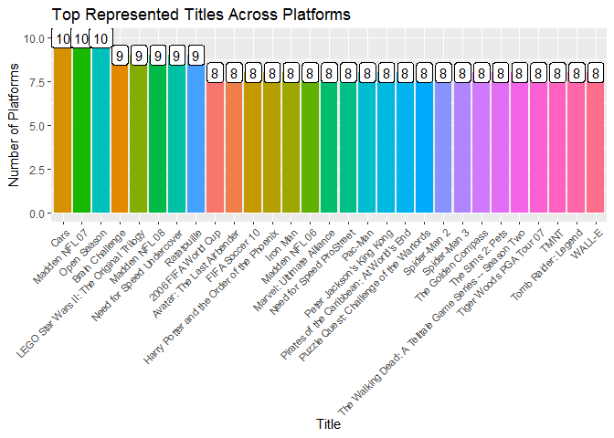<!-- -->

Top rated titles

``` r
subset(grouped_title_ign, score==10)
```

    ## # A tibble: 32 x 5
    ##    title                                score release_year count main_genre
    ##    <chr>                                <dbl>        <int> <int> <chr>     
    ##  1 Checkered Flag                          10         1999     1 Racing    
    ##  2 Dragon Warrior III                      10         2001     1 RPG       
    ##  3 Grand Theft Auto IV (Special Editio~    10         2008     2 Action    
    ##  4 Grand Theft Auto V                      10         2013     5 Action    
    ##  5 Infinity Blade II                       10         2011     1 Fighting  
    ##  6 Inside                                  10         2016     3 Adventure 
    ##  7 Mario Golf [Game Boy Color]             10         1999     1 Sports    
    ##  8 Metal Gear Solid [2000]                 10         2000     1 Action    
    ##  9 Metal Gear Solid 4: Guns of the Pat~    10         2008     1 Action    
    ## 10 Metal Gear Solid 4: Guns of the Pat~    10         2008     1 Action    
    ## # ... with 22 more rows

Box Plot of Mean Review

``` r
grouped_title_ign %>%
  group_by(main_genre) %>%
  ggplot() +
  geom_boxplot(aes(x=main_genre, y=score, fill="coral2")) +
  theme(axis.text.x = element_text(size = 8, angle = 45, hjust = 1)) +
  labs(title = "Boxplot of Mean Review Scores Across Genres", x="Main Genre", y="Review Score") +
  guides(fill=FALSE)
```

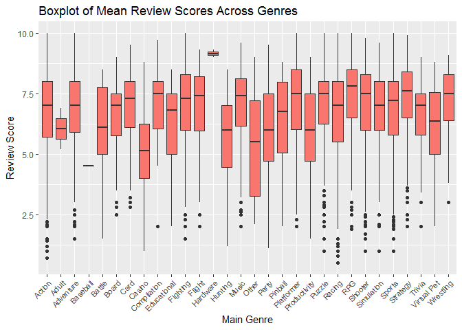<!-- -->

``` r
# install.packages('forecast', dependencies = TRUE, repos="http://cran.wustl.edu/")
# install.packages('TTR', dependencies = TRUE)
```

``` r
library(forecast)
```

    ## Warning: package 'forecast' was built under R version 3.5.3

``` r
# install.packages('directlabels')
library(directlabels)
```

    ## Warning: package 'directlabels' was built under R version 3.5.3

Seasonal Plot Across
    Platforms

``` r
unique(ign$release_year)
```

    ##  [1] 2012 2013 1996 1970 1997 1998 1999 2000 2001 2002 2003 2004 2005 2006
    ## [15] 2007 2008 2009 2010 2011 2014 2015 2016

``` r
ign %>%
  subset(., release_year>1990 & release_year<=2010) %>%
  group_by(platform, release_year) %>%
  summarise(total_games = n()) %>%
  subset(., total_games>10) %>%
  ggplot() +
  geom_line(aes(x=release_year, y=total_games, group=platform, col=platform))+
  geom_point(aes(x=release_year, y=total_games, group=platform, col=platform)) +
  geom_dl(aes(x=release_year, y=total_games, label = platform), method=list("first.bumpup", cex=0.5)) +
  guides(col=FALSE) +
  scale_x_continuous(breaks=c(1996:2010), 
                   labels=factor(1996:2010),
                   limits=c(1995,2010)) +
  labs(title="Number of IGN Listed Games Across Platforms 1996-2010", x='Release Year', y='IGN Listed Games in Year')
```

<!-- -->
