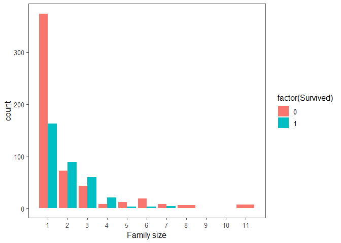
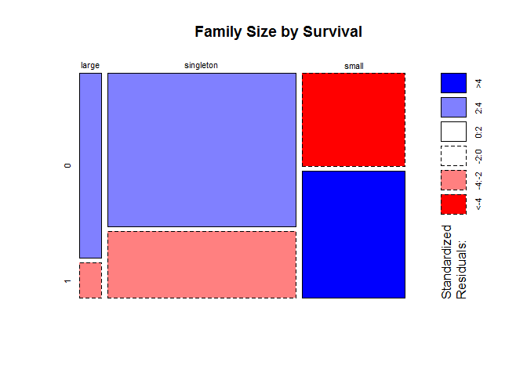
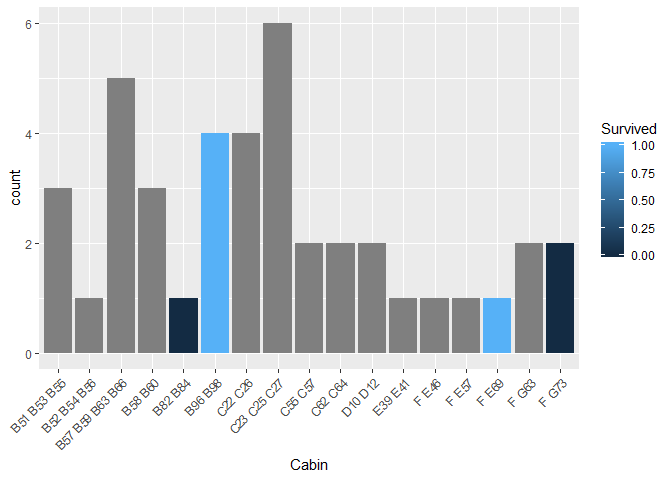
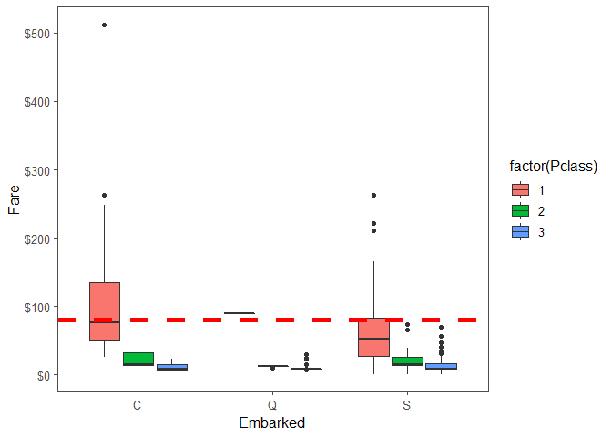
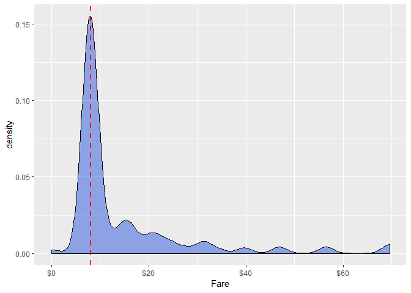
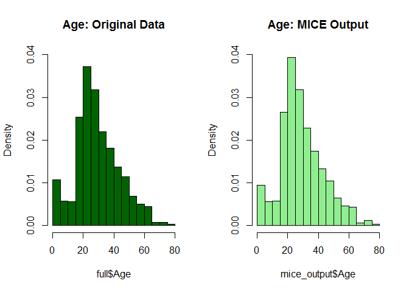
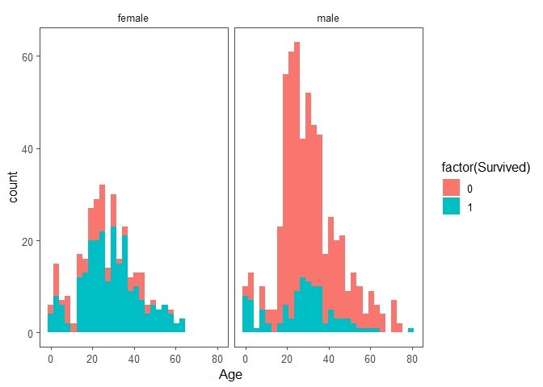
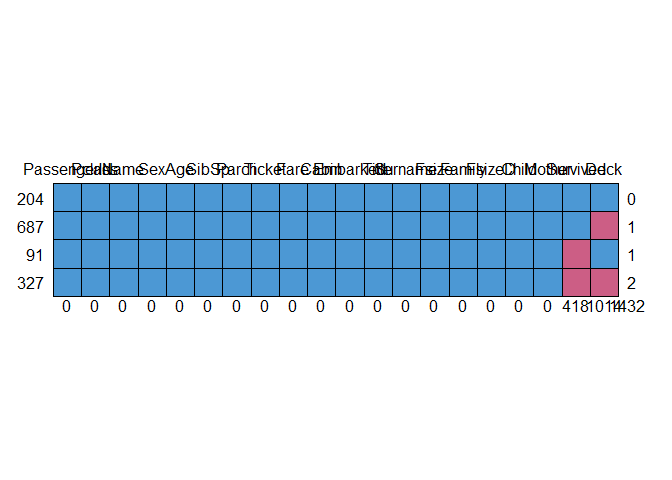
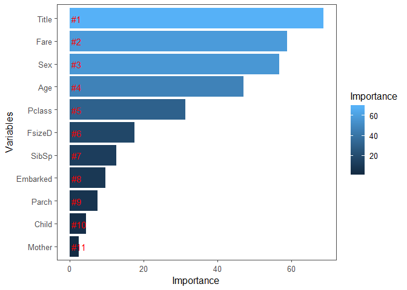

titanic
================
Marwa Mohamed
7/8/2019

## R Markdown

This is an R Markdown document. Markdown is a simple formatting syntax
for authoring HTML, PDF, and MS Word documents. For more details on
using R Markdown see <http://rmarkdown.rstudio.com>.

When you click the **Knit** button a document will be generated that
includes both content as well as the output of any embedded R code
chunks within the document. You can embed an R code chunk like this:

``` r
#load data
train <- read.csv('data/train.csv', stringsAsFactors = F)
test  <- read.csv('data/test.csv', stringsAsFactors = F)
# bind training & test data
full  <- bind_rows(train, test) 

# check data
str(full)
```

    ## 'data.frame':    1309 obs. of  12 variables:
    ##  $ PassengerId: int  1 2 3 4 5 6 7 8 9 10 ...
    ##  $ Survived   : int  0 1 1 1 0 0 0 0 1 1 ...
    ##  $ Pclass     : int  3 1 3 1 3 3 1 3 3 2 ...
    ##  $ Name       : chr  "Braund, Mr. Owen Harris" "Cumings, Mrs. John Bradley (Florence Briggs Thayer)" "Heikkinen, Miss. Laina" "Futrelle, Mrs. Jacques Heath (Lily May Peel)" ...
    ##  $ Sex        : chr  "male" "female" "female" "female" ...
    ##  $ Age        : num  22 38 26 35 35 NA 54 2 27 14 ...
    ##  $ SibSp      : int  1 1 0 1 0 0 0 3 0 1 ...
    ##  $ Parch      : int  0 0 0 0 0 0 0 1 2 0 ...
    ##  $ Ticket     : chr  "A/5 21171" "PC 17599" "STON/O2. 3101282" "113803" ...
    ##  $ Fare       : num  7.25 71.28 7.92 53.1 8.05 ...
    ##  $ Cabin      : chr  "" "C85" "" "C123" ...
    ##  $ Embarked   : chr  "S" "C" "S" "S" ...

## Feature engineering

Get the passengers titles & surnames

``` r
# Grab title from passenger names
full$Title <- gsub('(.*, )|(\\..*)', '', full$Name)

# Show title counts by sex
table(full$Sex, full$Title)
```

    ##         
    ##          Capt Col Don Dona  Dr Jonkheer Lady Major Master Miss Mlle Mme
    ##   female    0   0   0    1   1        0    1     0      0  260    2   1
    ##   male      1   4   1    0   7        1    0     2     61    0    0   0
    ##         
    ##           Mr Mrs  Ms Rev Sir the Countess
    ##   female   0 197   2   0   0            1
    ##   male   757   0   0   8   1            0

``` r
# Titles with very low cell counts to be combined to "rare" level
rare_title <- c('Dona', 'Lady', 'the Countess','Capt', 'Col', 'Don', 
                'Dr', 'Major', 'Rev', 'Sir', 'Jonkheer')

# Also reassign mlle, ms, and mme accordingly
full$Title[full$Title == 'Mlle']        <- 'Miss' 
full$Title[full$Title == 'Ms']          <- 'Miss'
full$Title[full$Title == 'Mme']         <- 'Mrs' 
full$Title[full$Title %in% rare_title]  <- 'Rare Title'

# Show title counts by sex again
table(full$Sex, full$Title)
```

    ##         
    ##          Master Miss  Mr Mrs Rare Title
    ##   female      0  264   0 198          4
    ##   male       61    0 757   0         25

``` r
# Finally, grab surname from passenger name
full$Surname <- sapply(full$Name,  
                      function(x) strsplit(x, split = '[,.]')[[1]][1])
cat(paste('We have ', nlevels(factor(full$Surname)), ' unique surnames. I would be interested to infer ethnicity based on surname --- another time.'))
```

    ## We have  875  unique surnames. I would be interested to infer ethnicity based on surname --- another time.

First we’re going to make a family size variable based on number of
siblings/spouse(s) (maybe someone has more than one spouse?) and number
of children/parents.

``` r
# Create a family size variable including the passenger themselves
full$Fsize <- full$SibSp + full$Parch + 1

# Create a family variable 
full$Family <- paste(full$Surname, full$Fsize, sep='_')

head(full$Family)
```

    ## [1] "Braund_2"    "Cumings_2"   "Heikkinen_1" "Futrelle_2"  "Allen_1"    
    ## [6] "Moran_1"

``` r
# Use ggplot2 to visualize the relationship between family size & survival
ggplot(full[1:891,], aes(x = Fsize, fill = factor(Survived))) + 
  geom_bar(position = "dodge") +
  labs(x = "Family size") +
  scale_x_continuous(breaks = c(1:11)) + 
  theme_few()
```

<!-- -->
Collapse this variable into three levels which will be helpful since
there are comparatively fewer large families

``` r
# Discretize family size
full$FsizeD[full$Fsize == 1] <- 'singleton'
full$FsizeD[full$Fsize < 5 & full$Fsize > 1] <- 'small'
full$FsizeD[full$Fsize > 4] <- 'large'

# Show family size by survival using a mosaic plot
mosaicplot(table(full$FsizeD, full$Survived), main='Family Size by Survival', shade=TRUE)
```

<!-- -->

``` r
# This variable appears to have a lot of missing values
full$Cabin[1:28]
```

    ##  [1] ""            "C85"         ""            "C123"        ""           
    ##  [6] ""            "E46"         ""            ""            ""           
    ## [11] "G6"          "C103"        ""            ""            ""           
    ## [16] ""            ""            ""            ""            ""           
    ## [21] ""            "D56"         ""            "A6"          ""           
    ## [26] ""            ""            "C23 C25 C27"

``` r
# The first character is the deck. For example:
length(strsplit(full$Cabin[28], " ")[[1]])
```

    ## [1] 3

``` r
# Create a Deck variable. Get passenger deck A - F:
full$Deck<-factor(sapply(full$Cabin, function(x) strsplit(x, "")[[1]][1]))
### extra
# Get cabins with multiple rooms
full$Cabin[sapply(full$Cabin, function(x) length(strsplit(x, " ")[[1]]))>1]
```

    ##  [1] "C23 C25 C27"     "F G73"           "C23 C25 C27"    
    ##  [4] "D10 D12"         "B58 B60"         "F E69"          
    ##  [7] "C22 C26"         "B58 B60"         "C22 C26"        
    ## [10] "B57 B59 B63 B66" "C23 C25 C27"     "B96 B98"        
    ## [13] "B96 B98"         "C23 C25 C27"     "C22 C26"        
    ## [16] "B51 B53 B55"     "F G63"           "C62 C64"        
    ## [19] "F G73"           "B57 B59 B63 B66" "B96 B98"        
    ## [22] "B82 B84"         "B96 B98"         "B51 B53 B55"    
    ## [25] "B57 B59 B63 B66" "C23 C25 C27"     "F G63"          
    ## [28] "B57 B59 B63 B66" "C23 C25 C27"     "C55 C57"        
    ## [31] "C55 C57"         "B57 B59 B63 B66" "B58 B60"        
    ## [34] "C62 C64"         "F E46"           "C22 C26"        
    ## [37] "F E57"           "B51 B53 B55"     "D10 D12"        
    ## [40] "E39 E41"         "B52 B54 B56"

``` r
# plot the relation between multiple rooms cabin and survival
 full %>% 
  filter(sapply(full$Cabin, function(x) length(strsplit(x, " ")[[1]]))>1) %>% 
  ggplot(aes(x = Cabin, fill = Survived)) + 
   geom_histogram(stat = "count") + 
   theme(axis.text.x = element_text(angle = 45, hjust = 1))
```

    ## filter: removed 1268 out of 1309 rows (97%)

    ## Warning: Ignoring unknown parameters: binwidth, bins, pad

<!-- -->
\#Missingness Missing Embarked

``` r
###extra
#check missing values
table(full$Embarked)
```

    ## 
    ##       C   Q   S 
    ##   2 270 123 914

``` r
#get ids of missing values
full$PassengerId[full$Embarked==""]
```

    ## [1]  62 830

``` r
###
# Passengers 62 and 830 are missing Embarkment
full[c(62, 830), 'Embarked']
```

    ## [1] "" ""

``` r
cat(paste('We will infer their values for **embarkment** based on present data that we can imagine may be relevant: **passenger class** and **fare**. We see that they paid<b> $', full[c(62, 830), 'Fare'][[1]][1], '</b>and<b> $', full[c(62, 830), 'Fare'][[1]][2], '</b>respectively and their classes are<b>', full[c(62, 830), 'Pclass'][[1]][1], '</b>and<b>', full[c(62, 830), 'Pclass'][[1]][2], '</b>. So from where did they embark?'))
```

    ## We will infer their values for **embarkment** based on present data that we can imagine may be relevant: **passenger class** and **fare**. We see that they paid<b> $ 80 </b>and<b> $ NA </b>respectively and their classes are<b> 1 </b>and<b> NA </b>. So from where did they embark?

``` r
# Get rid of our missing passenger IDs
embark_fare <- full %>%
  filter(PassengerId != 62 & PassengerId != 830)
```

    ## filter: removed 2 out of 1309 rows (<1%)

``` r
# Use ggplot2 to visualize embarkment, passenger class, & median fare
ggplot(embark_fare, aes(x = Embarked, y = Fare, fill = factor(Pclass))) +
  geom_boxplot() +
  # as passenger 62 paid fare $80
  geom_hline(aes(yintercept=80), colour='red', linetype='dashed', lwd=2) +
  scale_y_continuous(labels = dollar) + 
  theme_few()
```

    ## Warning: Removed 1 rows containing non-finite values (stat_boxplot).

<!-- -->

``` r
# Since their fare was $80 for 1st class, they most likely embarked from 'C'
full$Embarked[c(62, 830)] <- 'C'
```

Missing fare

``` r
#get observation with NA fare
full[is.na(full$Fare),]
```

    ##      PassengerId Survived Pclass               Name  Sex  Age SibSp Parch
    ## 1044        1044       NA      3 Storey, Mr. Thomas male 60.5     0     0
    ##      Ticket Fare Cabin Embarked Title Surname Fsize   Family    FsizeD
    ## 1044   3701   NA              S    Mr  Storey     1 Storey_1 singleton
    ##      Deck
    ## 1044 <NA>

``` r
#visualize Fares among all others sharing their class and embarkment (n = 494).
ggplot(full[full$Pclass == '3' & full$Embarked == 'S', ], aes(x = Fare)) + 
  geom_density(fill = "#0034dd", alpha = 0.4) +
  geom_vline(aes(xintercept=median(Fare, na.rm=T)), colour = "red", linetype = "dashed", lwd=1) + 
  scale_x_continuous(labels = dollar)
```

    ## Warning: Removed 1 rows containing non-finite values (stat_density).

<!-- -->

``` r
  theme_few()
```

    ## List of 59
    ##  $ line                 :List of 6
    ##   ..$ colour       : chr "#4D4D4D"
    ##   ..$ size         : num 0.545
    ##   ..$ linetype     : num 1
    ##   ..$ lineend      : chr "butt"
    ##   ..$ arrow        : logi FALSE
    ##   ..$ inherit.blank: logi FALSE
    ##   ..- attr(*, "class")= chr [1:2] "element_line" "element"
    ##  $ rect                 :List of 5
    ##   ..$ fill         : chr "white"
    ##   ..$ colour       : logi NA
    ##   ..$ size         : num 0.545
    ##   ..$ linetype     : num 1
    ##   ..$ inherit.blank: logi FALSE
    ##   ..- attr(*, "class")= chr [1:2] "element_rect" "element"
    ##  $ text                 :List of 11
    ##   ..$ family       : chr ""
    ##   ..$ face         : chr "plain"
    ##   ..$ colour       : chr "#000000"
    ##   ..$ size         : num 12
    ##   ..$ hjust        : num 0.5
    ##   ..$ vjust        : num 0.5
    ##   ..$ angle        : num 0
    ##   ..$ lineheight   : num 0.9
    ##   ..$ margin       : 'margin' num [1:4] 0pt 0pt 0pt 0pt
    ##   .. ..- attr(*, "valid.unit")= int 8
    ##   .. ..- attr(*, "unit")= chr "pt"
    ##   ..$ debug        : logi FALSE
    ##   ..$ inherit.blank: logi FALSE
    ##   ..- attr(*, "class")= chr [1:2] "element_text" "element"
    ##  $ axis.title.x         :List of 11
    ##   ..$ family       : NULL
    ##   ..$ face         : NULL
    ##   ..$ colour       : NULL
    ##   ..$ size         : NULL
    ##   ..$ hjust        : NULL
    ##   ..$ vjust        : num 1
    ##   ..$ angle        : NULL
    ##   ..$ lineheight   : NULL
    ##   ..$ margin       : 'margin' num [1:4] 3pt 0pt 0pt 0pt
    ##   .. ..- attr(*, "valid.unit")= int 8
    ##   .. ..- attr(*, "unit")= chr "pt"
    ##   ..$ debug        : NULL
    ##   ..$ inherit.blank: logi TRUE
    ##   ..- attr(*, "class")= chr [1:2] "element_text" "element"
    ##  $ axis.title.x.top     :List of 11
    ##   ..$ family       : NULL
    ##   ..$ face         : NULL
    ##   ..$ colour       : NULL
    ##   ..$ size         : NULL
    ##   ..$ hjust        : NULL
    ##   ..$ vjust        : num 0
    ##   ..$ angle        : NULL
    ##   ..$ lineheight   : NULL
    ##   ..$ margin       : 'margin' num [1:4] 0pt 0pt 3pt 0pt
    ##   .. ..- attr(*, "valid.unit")= int 8
    ##   .. ..- attr(*, "unit")= chr "pt"
    ##   ..$ debug        : NULL
    ##   ..$ inherit.blank: logi TRUE
    ##   ..- attr(*, "class")= chr [1:2] "element_text" "element"
    ##  $ axis.title.y         :List of 11
    ##   ..$ family       : NULL
    ##   ..$ face         : NULL
    ##   ..$ colour       : NULL
    ##   ..$ size         : NULL
    ##   ..$ hjust        : NULL
    ##   ..$ vjust        : num 1
    ##   ..$ angle        : num 90
    ##   ..$ lineheight   : NULL
    ##   ..$ margin       : 'margin' num [1:4] 0pt 3pt 0pt 0pt
    ##   .. ..- attr(*, "valid.unit")= int 8
    ##   .. ..- attr(*, "unit")= chr "pt"
    ##   ..$ debug        : NULL
    ##   ..$ inherit.blank: logi TRUE
    ##   ..- attr(*, "class")= chr [1:2] "element_text" "element"
    ##  $ axis.title.y.right   :List of 11
    ##   ..$ family       : NULL
    ##   ..$ face         : NULL
    ##   ..$ colour       : NULL
    ##   ..$ size         : NULL
    ##   ..$ hjust        : NULL
    ##   ..$ vjust        : num 0
    ##   ..$ angle        : num -90
    ##   ..$ lineheight   : NULL
    ##   ..$ margin       : 'margin' num [1:4] 0pt 0pt 0pt 3pt
    ##   .. ..- attr(*, "valid.unit")= int 8
    ##   .. ..- attr(*, "unit")= chr "pt"
    ##   ..$ debug        : NULL
    ##   ..$ inherit.blank: logi TRUE
    ##   ..- attr(*, "class")= chr [1:2] "element_text" "element"
    ##  $ axis.text            :List of 11
    ##   ..$ family       : NULL
    ##   ..$ face         : NULL
    ##   ..$ colour       : chr "grey30"
    ##   ..$ size         : 'rel' num 0.8
    ##   ..$ hjust        : NULL
    ##   ..$ vjust        : NULL
    ##   ..$ angle        : NULL
    ##   ..$ lineheight   : NULL
    ##   ..$ margin       : NULL
    ##   ..$ debug        : NULL
    ##   ..$ inherit.blank: logi TRUE
    ##   ..- attr(*, "class")= chr [1:2] "element_text" "element"
    ##  $ axis.text.x          :List of 11
    ##   ..$ family       : NULL
    ##   ..$ face         : NULL
    ##   ..$ colour       : NULL
    ##   ..$ size         : NULL
    ##   ..$ hjust        : NULL
    ##   ..$ vjust        : num 1
    ##   ..$ angle        : NULL
    ##   ..$ lineheight   : NULL
    ##   ..$ margin       : 'margin' num [1:4] 2.4pt 0pt 0pt 0pt
    ##   .. ..- attr(*, "valid.unit")= int 8
    ##   .. ..- attr(*, "unit")= chr "pt"
    ##   ..$ debug        : NULL
    ##   ..$ inherit.blank: logi TRUE
    ##   ..- attr(*, "class")= chr [1:2] "element_text" "element"
    ##  $ axis.text.x.top      :List of 11
    ##   ..$ family       : NULL
    ##   ..$ face         : NULL
    ##   ..$ colour       : NULL
    ##   ..$ size         : NULL
    ##   ..$ hjust        : NULL
    ##   ..$ vjust        : num 0
    ##   ..$ angle        : NULL
    ##   ..$ lineheight   : NULL
    ##   ..$ margin       : 'margin' num [1:4] 0pt 0pt 2.4pt 0pt
    ##   .. ..- attr(*, "valid.unit")= int 8
    ##   .. ..- attr(*, "unit")= chr "pt"
    ##   ..$ debug        : NULL
    ##   ..$ inherit.blank: logi TRUE
    ##   ..- attr(*, "class")= chr [1:2] "element_text" "element"
    ##  $ axis.text.y          :List of 11
    ##   ..$ family       : NULL
    ##   ..$ face         : NULL
    ##   ..$ colour       : NULL
    ##   ..$ size         : NULL
    ##   ..$ hjust        : num 1
    ##   ..$ vjust        : NULL
    ##   ..$ angle        : NULL
    ##   ..$ lineheight   : NULL
    ##   ..$ margin       : 'margin' num [1:4] 0pt 2.4pt 0pt 0pt
    ##   .. ..- attr(*, "valid.unit")= int 8
    ##   .. ..- attr(*, "unit")= chr "pt"
    ##   ..$ debug        : NULL
    ##   ..$ inherit.blank: logi TRUE
    ##   ..- attr(*, "class")= chr [1:2] "element_text" "element"
    ##  $ axis.text.y.right    :List of 11
    ##   ..$ family       : NULL
    ##   ..$ face         : NULL
    ##   ..$ colour       : NULL
    ##   ..$ size         : NULL
    ##   ..$ hjust        : num 0
    ##   ..$ vjust        : NULL
    ##   ..$ angle        : NULL
    ##   ..$ lineheight   : NULL
    ##   ..$ margin       : 'margin' num [1:4] 0pt 0pt 0pt 2.4pt
    ##   .. ..- attr(*, "valid.unit")= int 8
    ##   .. ..- attr(*, "unit")= chr "pt"
    ##   ..$ debug        : NULL
    ##   ..$ inherit.blank: logi TRUE
    ##   ..- attr(*, "class")= chr [1:2] "element_text" "element"
    ##  $ axis.ticks           :List of 6
    ##   ..$ colour       : chr "#4D4D4D"
    ##   ..$ size         : NULL
    ##   ..$ linetype     : NULL
    ##   ..$ lineend      : NULL
    ##   ..$ arrow        : logi FALSE
    ##   ..$ inherit.blank: logi FALSE
    ##   ..- attr(*, "class")= chr [1:2] "element_line" "element"
    ##  $ axis.ticks.length    : 'unit' num 3pt
    ##   ..- attr(*, "valid.unit")= int 8
    ##   ..- attr(*, "unit")= chr "pt"
    ##  $ axis.line            : list()
    ##   ..- attr(*, "class")= chr [1:2] "element_blank" "element"
    ##  $ axis.line.x          : NULL
    ##  $ axis.line.y          : NULL
    ##  $ legend.background    :List of 5
    ##   ..$ fill         : NULL
    ##   ..$ colour       : logi NA
    ##   ..$ size         : NULL
    ##   ..$ linetype     : NULL
    ##   ..$ inherit.blank: logi TRUE
    ##   ..- attr(*, "class")= chr [1:2] "element_rect" "element"
    ##  $ legend.margin        : 'margin' num [1:4] 6pt 6pt 6pt 6pt
    ##   ..- attr(*, "valid.unit")= int 8
    ##   ..- attr(*, "unit")= chr "pt"
    ##  $ legend.spacing       : 'unit' num 12pt
    ##   ..- attr(*, "valid.unit")= int 8
    ##   ..- attr(*, "unit")= chr "pt"
    ##  $ legend.spacing.x     : NULL
    ##  $ legend.spacing.y     : NULL
    ##  $ legend.key           :List of 5
    ##   ..$ fill         : chr "white"
    ##   ..$ colour       : logi NA
    ##   ..$ size         : NULL
    ##   ..$ linetype     : NULL
    ##   ..$ inherit.blank: logi FALSE
    ##   ..- attr(*, "class")= chr [1:2] "element_rect" "element"
    ##  $ legend.key.size      : 'unit' num 1.2lines
    ##   ..- attr(*, "valid.unit")= int 3
    ##   ..- attr(*, "unit")= chr "lines"
    ##  $ legend.key.height    : NULL
    ##  $ legend.key.width     : NULL
    ##  $ legend.text          :List of 11
    ##   ..$ family       : NULL
    ##   ..$ face         : NULL
    ##   ..$ colour       : NULL
    ##   ..$ size         : 'rel' num 0.8
    ##   ..$ hjust        : NULL
    ##   ..$ vjust        : NULL
    ##   ..$ angle        : NULL
    ##   ..$ lineheight   : NULL
    ##   ..$ margin       : NULL
    ##   ..$ debug        : NULL
    ##   ..$ inherit.blank: logi TRUE
    ##   ..- attr(*, "class")= chr [1:2] "element_text" "element"
    ##  $ legend.text.align    : NULL
    ##  $ legend.title         :List of 11
    ##   ..$ family       : NULL
    ##   ..$ face         : NULL
    ##   ..$ colour       : NULL
    ##   ..$ size         : NULL
    ##   ..$ hjust        : num 0
    ##   ..$ vjust        : NULL
    ##   ..$ angle        : NULL
    ##   ..$ lineheight   : NULL
    ##   ..$ margin       : NULL
    ##   ..$ debug        : NULL
    ##   ..$ inherit.blank: logi TRUE
    ##   ..- attr(*, "class")= chr [1:2] "element_text" "element"
    ##  $ legend.title.align   : NULL
    ##  $ legend.position      : chr "right"
    ##  $ legend.direction     : NULL
    ##  $ legend.justification : chr "center"
    ##  $ legend.box           : NULL
    ##  $ legend.box.margin    : 'margin' num [1:4] 0cm 0cm 0cm 0cm
    ##   ..- attr(*, "valid.unit")= int 1
    ##   ..- attr(*, "unit")= chr "cm"
    ##  $ legend.box.background: list()
    ##   ..- attr(*, "class")= chr [1:2] "element_blank" "element"
    ##  $ legend.box.spacing   : 'unit' num 12pt
    ##   ..- attr(*, "valid.unit")= int 8
    ##   ..- attr(*, "unit")= chr "pt"
    ##  $ panel.background     :List of 5
    ##   ..$ fill         : chr "white"
    ##   ..$ colour       : logi NA
    ##   ..$ size         : NULL
    ##   ..$ linetype     : NULL
    ##   ..$ inherit.blank: logi TRUE
    ##   ..- attr(*, "class")= chr [1:2] "element_rect" "element"
    ##  $ panel.border         :List of 5
    ##   ..$ fill         : logi NA
    ##   ..$ colour       : chr "#4D4D4D"
    ##   ..$ size         : NULL
    ##   ..$ linetype     : NULL
    ##   ..$ inherit.blank: logi FALSE
    ##   ..- attr(*, "class")= chr [1:2] "element_rect" "element"
    ##  $ panel.spacing        : 'unit' num 6pt
    ##   ..- attr(*, "valid.unit")= int 8
    ##   ..- attr(*, "unit")= chr "pt"
    ##  $ panel.spacing.x      : NULL
    ##  $ panel.spacing.y      : NULL
    ##  $ panel.grid           : list()
    ##   ..- attr(*, "class")= chr [1:2] "element_blank" "element"
    ##  $ panel.grid.minor     :List of 6
    ##   ..$ colour       : NULL
    ##   ..$ size         : 'rel' num 0.5
    ##   ..$ linetype     : NULL
    ##   ..$ lineend      : NULL
    ##   ..$ arrow        : logi FALSE
    ##   ..$ inherit.blank: logi TRUE
    ##   ..- attr(*, "class")= chr [1:2] "element_line" "element"
    ##  $ panel.ontop          : logi FALSE
    ##  $ plot.background      :List of 5
    ##   ..$ fill         : NULL
    ##   ..$ colour       : chr "white"
    ##   ..$ size         : NULL
    ##   ..$ linetype     : NULL
    ##   ..$ inherit.blank: logi TRUE
    ##   ..- attr(*, "class")= chr [1:2] "element_rect" "element"
    ##  $ plot.title           :List of 11
    ##   ..$ family       : NULL
    ##   ..$ face         : NULL
    ##   ..$ colour       : NULL
    ##   ..$ size         : 'rel' num 1.2
    ##   ..$ hjust        : num 0
    ##   ..$ vjust        : num 1
    ##   ..$ angle        : NULL
    ##   ..$ lineheight   : NULL
    ##   ..$ margin       : 'margin' num [1:4] 0pt 0pt 6pt 0pt
    ##   .. ..- attr(*, "valid.unit")= int 8
    ##   .. ..- attr(*, "unit")= chr "pt"
    ##   ..$ debug        : NULL
    ##   ..$ inherit.blank: logi TRUE
    ##   ..- attr(*, "class")= chr [1:2] "element_text" "element"
    ##  $ plot.subtitle        :List of 11
    ##   ..$ family       : NULL
    ##   ..$ face         : NULL
    ##   ..$ colour       : NULL
    ##   ..$ size         : NULL
    ##   ..$ hjust        : num 0
    ##   ..$ vjust        : num 1
    ##   ..$ angle        : NULL
    ##   ..$ lineheight   : NULL
    ##   ..$ margin       : 'margin' num [1:4] 0pt 0pt 6pt 0pt
    ##   .. ..- attr(*, "valid.unit")= int 8
    ##   .. ..- attr(*, "unit")= chr "pt"
    ##   ..$ debug        : NULL
    ##   ..$ inherit.blank: logi TRUE
    ##   ..- attr(*, "class")= chr [1:2] "element_text" "element"
    ##  $ plot.caption         :List of 11
    ##   ..$ family       : NULL
    ##   ..$ face         : NULL
    ##   ..$ colour       : NULL
    ##   ..$ size         : 'rel' num 0.8
    ##   ..$ hjust        : num 1
    ##   ..$ vjust        : num 1
    ##   ..$ angle        : NULL
    ##   ..$ lineheight   : NULL
    ##   ..$ margin       : 'margin' num [1:4] 6pt 0pt 0pt 0pt
    ##   .. ..- attr(*, "valid.unit")= int 8
    ##   .. ..- attr(*, "unit")= chr "pt"
    ##   ..$ debug        : NULL
    ##   ..$ inherit.blank: logi TRUE
    ##   ..- attr(*, "class")= chr [1:2] "element_text" "element"
    ##  $ plot.tag             :List of 11
    ##   ..$ family       : NULL
    ##   ..$ face         : NULL
    ##   ..$ colour       : NULL
    ##   ..$ size         : 'rel' num 1.2
    ##   ..$ hjust        : num 0.5
    ##   ..$ vjust        : num 0.5
    ##   ..$ angle        : NULL
    ##   ..$ lineheight   : NULL
    ##   ..$ margin       : NULL
    ##   ..$ debug        : NULL
    ##   ..$ inherit.blank: logi TRUE
    ##   ..- attr(*, "class")= chr [1:2] "element_text" "element"
    ##  $ plot.tag.position    : chr "topleft"
    ##  $ plot.margin          : 'margin' num [1:4] 6pt 6pt 6pt 6pt
    ##   ..- attr(*, "valid.unit")= int 8
    ##   ..- attr(*, "unit")= chr "pt"
    ##  $ strip.background     :List of 5
    ##   ..$ fill         : chr "white"
    ##   ..$ colour       : logi NA
    ##   ..$ size         : NULL
    ##   ..$ linetype     : NULL
    ##   ..$ inherit.blank: logi FALSE
    ##   ..- attr(*, "class")= chr [1:2] "element_rect" "element"
    ##  $ strip.placement      : chr "inside"
    ##  $ strip.text           :List of 11
    ##   ..$ family       : NULL
    ##   ..$ face         : NULL
    ##   ..$ colour       : chr "grey10"
    ##   ..$ size         : 'rel' num 0.8
    ##   ..$ hjust        : NULL
    ##   ..$ vjust        : NULL
    ##   ..$ angle        : NULL
    ##   ..$ lineheight   : NULL
    ##   ..$ margin       : 'margin' num [1:4] 4.8pt 4.8pt 4.8pt 4.8pt
    ##   .. ..- attr(*, "valid.unit")= int 8
    ##   .. ..- attr(*, "unit")= chr "pt"
    ##   ..$ debug        : NULL
    ##   ..$ inherit.blank: logi TRUE
    ##   ..- attr(*, "class")= chr [1:2] "element_text" "element"
    ##  $ strip.text.x         : NULL
    ##  $ strip.text.y         :List of 11
    ##   ..$ family       : NULL
    ##   ..$ face         : NULL
    ##   ..$ colour       : NULL
    ##   ..$ size         : NULL
    ##   ..$ hjust        : NULL
    ##   ..$ vjust        : NULL
    ##   ..$ angle        : num -90
    ##   ..$ lineheight   : NULL
    ##   ..$ margin       : NULL
    ##   ..$ debug        : NULL
    ##   ..$ inherit.blank: logi TRUE
    ##   ..- attr(*, "class")= chr [1:2] "element_text" "element"
    ##  $ strip.switch.pad.grid: 'unit' num 3pt
    ##   ..- attr(*, "valid.unit")= int 8
    ##   ..- attr(*, "unit")= chr "pt"
    ##  $ strip.switch.pad.wrap: 'unit' num 3pt
    ##   ..- attr(*, "valid.unit")= int 8
    ##   ..- attr(*, "unit")= chr "pt"
    ##  - attr(*, "class")= chr [1:2] "theme" "gg"
    ##  - attr(*, "complete")= logi TRUE
    ##  - attr(*, "validate")= logi TRUE

``` r
  # Replace missing fare value with median fare for class/embarkment
full$Fare[is.na(full$Fare)] <- median(full[full$Pclass == '3' & full$Embarked == 'S', ]$Fare, na.rm = TRUE)
```

Missing age predication

``` r
# Show number of missing Age values
sum(is.na(full$Age))
```

    ## [1] 263

``` r
# Make variables factors into factors
factor_vars <- c('PassengerId','Pclass','Sex','Embarked',
                 'Title','Surname','Family','FsizeD')

full[factor_vars] <- lapply(full[factor_vars], function(x) as.factor(x))

# Set a random seed
set.seed(129)

# Perform mice imputation, excluding certain less-than-useful variables:
mice_mod <- mice(full[, !names(full) %in% c('PassengerId','Name','Ticket','Cabin','Family','Surname','Survived')], method='rf') 
```

    ## 
    ##  iter imp variable
    ##   1   1  Age  Deck
    ##   1   2  Age  Deck
    ##   1   3  Age  Deck
    ##   1   4  Age  Deck
    ##   1   5  Age  Deck
    ##   2   1  Age  Deck
    ##   2   2  Age  Deck
    ##   2   3  Age  Deck
    ##   2   4  Age  Deck
    ##   2   5  Age  Deck
    ##   3   1  Age  Deck
    ##   3   2  Age  Deck
    ##   3   3  Age  Deck
    ##   3   4  Age  Deck
    ##   3   5  Age  Deck
    ##   4   1  Age  Deck
    ##   4   2  Age  Deck
    ##   4   3  Age  Deck
    ##   4   4  Age  Deck
    ##   4   5  Age  Deck
    ##   5   1  Age  Deck
    ##   5   2  Age  Deck
    ##   5   3  Age  Deck
    ##   5   4  Age  Deck
    ##   5   5  Age  Deck

    ## Warning: Number of logged events: 50

``` r
# Save the complete output 
mice_output <- complete(mice_mod)

# Plot age distributions
par(mfrow=c(1,2))
hist(full$Age, freq=F, main='Age: Original Data', 
  col='darkgreen', ylim=c(0,0.04))
hist(mice_output$Age, freq=F, main='Age: MICE Output', 
  col='lightgreen', ylim=c(0,0.04))
```

<!-- -->

``` r
# Replace Age variable from the mice model.
full$Age <- mice_output$Age

# Show new number of missing Age values
sum(is.na(full$Age))
```

    ## [1] 0

create a couple of new age-dependent variables: Child and Mother. A
child will simply be someone under 18 years of age and a mother is a
passenger who is 1) female, 2) is over 18, 3) has more than 0 children
(no kidding\!), and 4) does not have the title ‘Miss’.

``` r
# First we'll look at the relationship between age & survival
ggplot(full[1:891,], aes(Age, fill = factor(Survived))) + 
  geom_histogram() + 
  # I include Sex since we know (a priori) it's a significant predictor
  facet_grid(.~Sex) + 
  theme_few()
```

    ## `stat_bin()` using `bins = 30`. Pick better value with `binwidth`.

<!-- -->

``` r
# Create the column child, and indicate whether child or adult
full$Child[full$Age < 18] <- 'Child'
full$Child[full$Age >= 18] <- 'Adult'

# Show counts
table(full$Child, full$Survived)
```

    ##        
    ##           0   1
    ##   Adult 481 272
    ##   Child  68  70

``` r
# Adding Mother variable
full$Mother <- 'Not Mother'
full$Mother[full$Sex == 'female' & full$Parch > 0 & full$Age > 18 & full$Title != 'Miss'] <- 'Mother'

# Show counts
table(full$Mother, full$Survived)
```

    ##             
    ##                0   1
    ##   Mother      16  39
    ##   Not Mother 533 303

``` r
# Finish by factorizing our two new factor variables
full$Child  <- factor(full$Child)
full$Mother <- factor(full$Mother)

#check for missing data
md.pattern(full)
```

<!-- -->

    ##     PassengerId Pclass Name Sex Age SibSp Parch Ticket Fare Cabin Embarked
    ## 204           1      1    1   1   1     1     1      1    1     1        1
    ## 687           1      1    1   1   1     1     1      1    1     1        1
    ## 91            1      1    1   1   1     1     1      1    1     1        1
    ## 327           1      1    1   1   1     1     1      1    1     1        1
    ##               0      0    0   0   0     0     0      0    0     0        0
    ##     Title Surname Fsize Family FsizeD Child Mother Survived Deck     
    ## 204     1       1     1      1      1     1      1        1    1    0
    ## 687     1       1     1      1      1     1      1        1    0    1
    ## 91      1       1     1      1      1     1      1        0    1    1
    ## 327     1       1     1      1      1     1      1        0    0    2
    ##         0       0     0      0      0     0      0      418 1014 1432

\#Prediction At last we’re ready to predict who survives among
passengers of the Titanic based on variables that we carefully curated
and treated for missing values. For this, we will rely on the
randomForest classification algorithm; we spent all that time on
imputation, after all.

Split into training & test sets

``` r
# Split the data back into a train set and a test set
train <- full[1:891,]
test <- full[892:1309,]
```

Building the model

``` r
# Set a random seed
set.seed(754)

# Build the model (note: not all possible variables are used)
rf_model <- randomForest(factor(Survived) ~ Pclass + Sex + Age + SibSp + Parch + 
                                            Fare + Embarked + Title + 
                                            FsizeD + Child + Mother,
                                            data = train)

# Show model error
#The black line shows the overall error rate which falls below 20%. The red and green lines show the error rate for #‘died’ and ‘survived’ respectively. We can see that right now we’re much more successful predicting death than we #are survival. What does that say about me, I wonder?
plot(rf_model, ylim=c(0,0.36))
legend('topright', colnames(rf_model$err.rate), col=1:3, fill=1:3)
```

<!-- -->
Variable importance Let’s look at relative variable importance by
plotting the mean decrease in Gini calculated across all trees.

``` r
# Get importance
importance    <- importance(rf_model)
varImportance <- data.frame(Variables = row.names(importance), 
                            Importance = round(importance[ ,'MeanDecreaseGini'],2))

# Create a rank variable based on importance
rankImportance <- varImportance %>%
  mutate(Rank = paste0('#',dense_rank(desc(Importance))))
```

    ## mutate: new variable 'Rank' with 11 unique values and 0% NA

``` r
# Use ggplot2 to visualize the relative importance of variables
ggplot(rankImportance, aes(x = reorder(Variables, Importance), 
    y = Importance, fill = Importance)) +
  geom_bar(stat='identity') + 
  geom_text(aes(x = Variables, y = 0.5, label = Rank),
    hjust=0, vjust=0.55, size = 4, colour = 'red') +
  labs(x = 'Variables') +
  coord_flip() + 
  theme_few()
```

<!-- -->

Prediction\! We’re ready for the final step — making our prediction\!
When we finish here, we could iterate through the preceding steps making
tweaks as we go or fit the data using different models or use different
combinations of variables to achieve better predictions.

``` r
# Predict using the test set
prediction <- predict(rf_model, test)

# Save the solution to a dataframe with two columns: PassengerId and Survived (prediction)
solution <- data.frame(PassengerID = test$PassengerId, Survived = prediction)

# Write the solution to file
write.csv(solution, file = 'rf_mod_Solution.csv', row.names = F)
```
